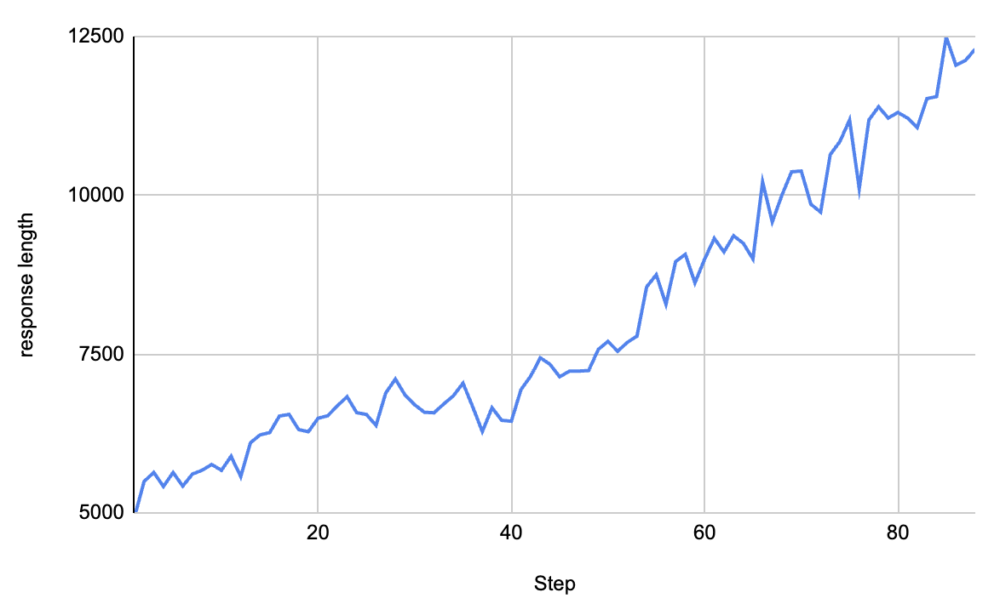
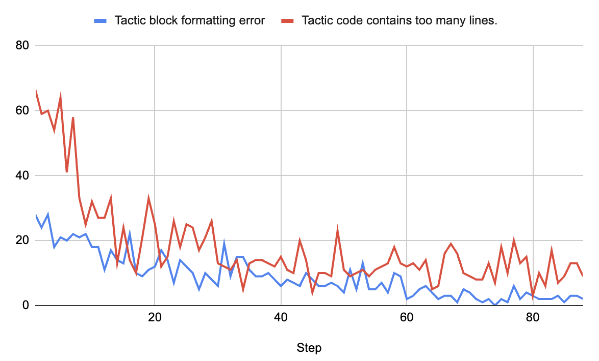
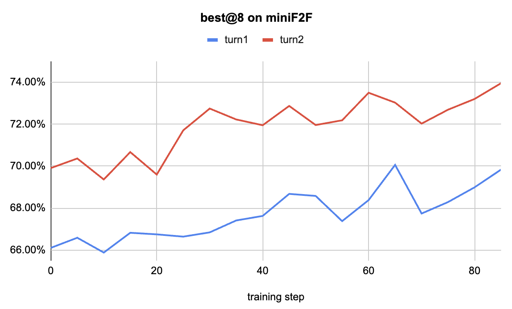

<h1 align="center">Kimina Prover RL</h1>

<p align="center">
<b>A slimmed-down training pipeline from Kimina Prover, with core features and full compatibility with <a href="https://github.com/volcengine/verl">Verl</a>. ⚡️</b>
</p>

<p align="center">
    <a href="https://projectnumina.ai/"></a>
    <a href="https://huggingface.co/AI-MO"></a>
</p>

---

**Kimina-Prover-RL** is an open-source training pipeline for formal theorem proving in **Lean 4**, based on a structured *reasoning-then-generation* paradigm inspired by [DeepSeek-R1](https://arxiv.org/abs/2501.12948).

This pipeline is a simplified version of the system used to train **[Kimina Prover](https://arxiv.org/abs/2504.11354)**, retaining its core components and offering full compatibility with the open-source **Verl** framework.

As a result of this training pipeline, we are releasing two models:

- **[`AI-MO/Kimina-Prover-RL-1.7B`](https://huggingface.co/AI-MO/Kimina-Prover-RL-1.7B)**, a 1.7B-parameter model that achieves 76.63% Pass@32 on the MiniF2F benchmark — setting a new state of the art for open-source models in this size category
- **[`AI-MO/Kimina-Prover-RL-0.6B`](https://huggingface.co/AI-MO/Kimina-Prover-RL-0.6B)**, a 0.6B-parameter model that achieves 71.30% Pass@32 on the MiniF2F benchmark — also setting a new state of the art for open-source models in this size category.

👉 **[Read the full blog post](https://huggingface.co/blog/AI-MO/kimina-prover-rl)**

## 🚀 Installation

First, follow the installation instructions from the **Verl** [documentation](https://verl.readthedocs.io/en/latest/start/install.html).

To verify Lean 4 proofs efficiently, we use the [**kimina-lean-server**](https://github.com/project-numina/kimina-lean-server), which supports high-throughput parallel checking.

We recommend using the Docker image we provide:

```bash
docker run -d \
  --name server \
  --restart unless-stopped \
  -p 80:8000 \
  projectnumina/kimina-lean-server:2.0.0
```

Then install our code using:

```
pip install -e .
```

## 📦 Running the Recipe
```
cd recipe/kimina_prover_rl

export LEAN_SERVER_API_URL="http://localhost"
```
If your server is configured with an API key you’ll also need to export it:

```
export LEAN_SERVER_API_KEY="your-api-key"
```

To start training, simply run:

```
sh kimina_prover_1.7B.sh
```

This script will download the dataset and launch the training. You can edit it to adapt it to your hardware and environment.

Alternatively, you can run a smaller version of the training for debugging purposes:

```
sh kimina_prover_1.7B_dry_run.sh
```

or you can use our 0.6B model:

```
sh kimina_prover_0.6B.sh
```

## 📊 Expected Results

During training, you should see on wandb the mean response length growing and the number of formatting errors decreasing:
<p align="center">
  
  
</p>


You should also see the best@8 mean performance increasing on MiniF2F before and after error correction:




After training, the model achieves 76.63% Pass@32 on MiniF2F

## 🧠 Resources

- [Blog Post (training details)](https://huggingface.co/blog/AI-MO/kimina-prover-rl)
- [Model on Hugging Face](https://huggingface.co/collections/AI-MO/kimina-prover-686b72614760ed23038056c5)
- [Dataset on Hugging Face](https://huggingface.co/datasets/AI-MO/NuminaMath-LEAN)
- [Kimina Lean Server](https://github.com/project-numina/kimina-lean-server)
- [Kimina Prover Preview paper](https://arxiv.org/abs/2504.11354)
- [Kimina Prover blog post](https://huggingface.co/blog/AI-MO/kimina-prover)
